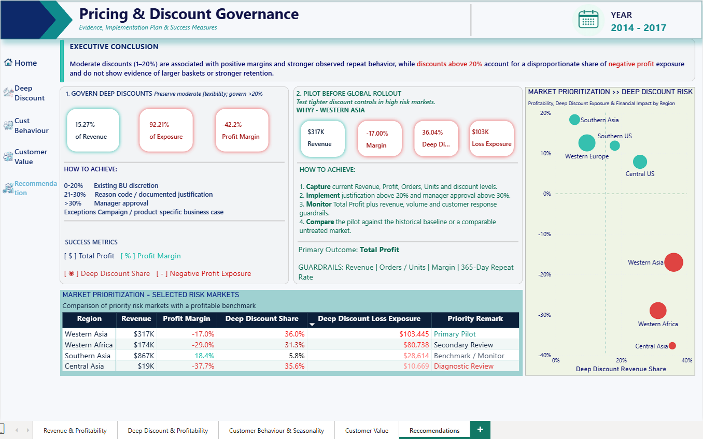

# E-commerce Revenue & Margin Leakage Analysis

> *Analyzing revenue, profitability, discount exposure and customer behavior to identify where deep discounting creates margin leakage in a global e-commerce business.*

------------------------------------------------------------------------

## Key Results at a Glance

| Finding | Result |
|---|---:|
| Total Revenue | **$12.64M** |
| Total Profit | **$1.47M** |
| Overall Profit Margin | **11.61%** |
| Negative Profit Exposure | **$921K** |
| Primary Discount Risk Threshold | **Above 20%** |
| Subcategories Profitable at ≤20% Discount | **17 of 17** |
| Analysis Period | **2014 to 2017** |

------------------------------------------------------------------------

## ⚙️ Project Type Flags

* Business Intelligence
* Power BI Dashboard
* Data Cleaning and Transformation
* Data Modeling
* DAX Analysis
* Profitability Analysis
* Customer Behavior Analysis
* Data Visualization
* End to End Business Analysis

------------------------------------------------------------------------

## Table of Contents

1. [Project Overview](#1-project-overview)
2. [Objectives](#2-objectives)
3. [Project Scope & Tools](#3-project-scope--tools)
4. [Repository Structure](#4-repository-structure)
5. [Data Workflow](#5-data-workflow)
6. [Data Model & Schema](#6-data-model--schema)
7. [Analysis & Metrics](#7-analysis--metrics)
8. [Dashboard Walkthrough](#8-dashboard-walkthrough)
9. [Key Insights](#9-key-insights)
10. [Recommendations](#10-recommendations)
11. [Assumptions & Limitations](#11-assumptions--limitations)
12. [Future Enhancements](#12-future-enhancements)
13. [Deliverables](#13-deliverables)
14. [Author](#14-author)

------------------------------------------------------------------------

## 1. Project Overview

**Context:** Revenue growth does not always translate into profitable growth. In e-commerce, discounting can support sales volume and customer acquisition, but aggressive discounts can also reduce margin and create significant loss exposure.

This project examines how discount depth affects revenue, profitability and customer behavior across a global e-commerce retailer.

The analysis focuses on the relationship between:

**Revenue Performance → Discount Depth → Profitability → Customer Behavior**

**Problem Statement:** How can the business reduce margin leakage from deep discounting without sacrificing sales volume, order value or customer activity?

**Approach:** The project uses Power Query for data preparation, a fact and dimension data model, DAX measures, discount segmentation, profitability analysis, customer behavior analysis and executive level Power BI reporting.

Five analytical questions guide the project:

1. How are revenue, profit and margin performing over time?
2. Where is negative profit exposure concentrated?
3. How does profitability change as discount depth increases?
4. Do deeper discounts generate larger baskets or stronger repeat behavior?
5. What commercial actions could reduce margin leakage without materially reducing demand?

**Outcome:** The analysis found that:

* Discounts above 20% are associated with substantially greater negative profit exposure.
* All 17 analyzed subcategories remained profitable when discounts were maintained at 20% or below.
* Deeper discounts did not consistently produce enough improvement in average order value to offset margin loss.
* Customer behavior did not provide sufficient evidence that aggressive discounting consistently improves repeat purchasing.
* Margin leakage is concentrated within specific products, categories, markets and discount levels.

------------------------------------------------------------------------

## 2. Objectives

**Primary Objective:** Identify where discounting begins to materially reduce profitability and determine whether deeper discounts generate sufficient commercial value to justify the margin sacrifice.

**Secondary Objectives

1:** Evaluate revenue, profit and profit margin performance over time.

2:** Measure negative profit exposure across categories, products and markets.

3:** Compare profitability across different discount bands.

4:** Evaluate the commercial difference between discounts of 20% or below and discounts above 20%.

5:** Assess whether deeper discounts are associated with larger average order values or stronger order frequency.

6:** Examine customer repeat behavior in relation to discount exposure.

7:** Translate analytical findings into practical actions for discount governance and profitability improvement.

> 💡 *Every dashboard page and analytical measure supports one or more of these objectives.*

------------------------------------------------------------------------

## 3. Project Scope & Tools

### Scope

| Dimension | Details |
|---|---|
| **In Scope** | Revenue, profit, discounting, orders, products, customer behavior, returns, categories, markets and margin leakage |
| **Out of Scope** | Causal inference, price elasticity modeling, promotion cost modeling, competitor pricing and predictive forecasting |
| **Analysis Period** | 2014 to 2017 |
| **Granularity** | Transaction level sales data |
| **Primary Analysis Level** | Order, product, customer, category and market |
| **Business Focus** | Revenue quality and profitability protection |

### Tools & Technologies

| Category | Tool(s) Used |
|---|---|
| Data Preparation | Power Query |
| Data Modeling | Power BI Data Model |
| Analysis | DAX |
| Visualization | Power BI |
| Time Intelligence | DAX |
| Documentation | Markdown |
| Version Control | Git / GitHub |

------------------------------------------------------------------------

## 4. Repository Structure

```text
Project_3_Ecommerce_Revenue_Margin_Leakage_Analysis/
│
├── README.md
├── Project 3 - Revenue & Discount Analysis.pbix
│
└── images/
    ├── Executive-Summary.png
    ├── Discount-Profitability.png
    ├── Customer-Behaviour.png
    ├── Customer-Value.png
    └── recommendations.png
```

------------------------------------------------------------------------

## 5. Data Workflow

```text
Source Sales Data
        ↓
Data Quality Review
        ↓
Power Query Transformation
        ↓
Fact and Dimension Modeling
        ↓
DAX Measure Development
        ↓
Discount Band Segmentation
        ↓
Profitability Analysis
        ↓
Customer Behavior Analysis
        ↓
Margin Leakage Analysis
        ↓
Dashboard Development
        ↓
Insights & Recommendations
```

### 1. Data Preparation

Power Query was used to prepare the source data for analysis.

The preparation process included:

* Reviewing data types
* Validating revenue, profit, quantity and discount fields
* Standardizing categorical fields
* Preparing return indicators
* Creating analysis ready tables
* Removing unnecessary staging elements from the reporting model

### 2. Data Modeling

The report was structured using a fact and dimension approach.

The model separates transactional data from descriptive dimensions to improve filtering, measure reuse and time intelligence.

### 3. Measure Development

Reusable DAX measures were created for:

* Revenue
* Profit
* Profit Margin
* Order Count
* Units Sold
* Average Order Value
* Discounted Sales
* Negative Profit Exposure
* Loss Exposure Rate
* Return Rate
* Year over Year Performance
* Customer Behavior

### 4. Discount Segmentation

Transactions were grouped into discount bands to evaluate how profitability changes as discount depth increases.

### 5. Business Analysis

The analysis combines executive performance, discount profitability, customer behavior and customer value to determine whether aggressive discounting is commercially justified.

### 6. Output

The final output includes:

* Executive Power BI dashboard
* Discount profitability analysis
* Customer behavior analysis
* Customer value analysis
* Margin leakage reporting
* Management recommendations
* GitHub case study documentation

------------------------------------------------------------------------

## 6. Data Model & Schema

### Fact Table

#### `FactSales`

| Field | Purpose |
|---|---|
| Sales | Transaction revenue |
| Profit | Transaction profit or loss |
| Quantity | Units sold |
| Discount | Discount applied to the transaction |
| Order Information | Order level identifiers and attributes |
| Returned Flag | Identifies returned orders |

### Dimension Tables

#### `DimDate`

| Field | Purpose |
|---|---|
| Date | Calendar date |
| Year | Reporting year |
| Month | Reporting month |
| Year Month | Time series reporting field |
| Year Month Sort | Chronological sorting |

#### `DimProduct`

| Field | Purpose |
|---|---|
| Product | Product name |
| Category | Product category |
| Subcategory | Product subcategory |

#### `DimCustomer`

| Field | Purpose |
|---|---|
| Customer | Customer identifier |
| Segment | Customer segment |

#### `DimMarket / Region`

| Field | Purpose |
|---|---|
| Market | Geographic market |
| Region | Geographic region |
| Region Lead | Regional management attribute |

### Measures Table

A dedicated measures table is used to organize analytical calculations separately from the transactional tables.

------------------------------------------------------------------------

## 7. Analysis & Metrics

### Analytical Framework

The analysis follows four connected stages:

**Executive Performance → Discount Profitability → Customer Behavior → Business Action**

### Revenue & Profitability

Key metrics include:

| Metric | Purpose |
|---|---|
| Total Revenue | Measure total sales generated |
| Total Profit | Measure net profitability |
| Profit Margin | Evaluate profit relative to revenue |
| Order Count | Measure transaction volume |
| Units Sold | Measure product volume |
| Average Order Value | Evaluate average revenue per order |

### Margin Leakage

Margin leakage analysis focuses on transactions that generate negative profit.

Key metrics include:

| Metric | Purpose |
|---|---|
| Total Loss Amount | Measure total negative profit |
| Loss Exposure Rate | Measure loss exposure relative to revenue |
| Contribution to Total Loss | Identify products and categories driving losses |

### Discount Analysis

Discounts were segmented into the following bands:

| Discount Band |
|---|
| 0% |
| 0 to 10% |
| 10 to 20% |
| 20 to 30% |
| 30 to 40% |
| 40 to 50% |
| Above 50% |

The primary comparison focuses on:

**≤20% Discount**

and

**>20% Discount**

This comparison was used to evaluate where discounting begins to create materially greater profit risk.

### Customer Analysis

Customer behavior was evaluated using:

* Order frequency
* Average order value
* Repeat purchasing
* Profit margin
* Discount exposure
* Customer profitability

------------------------------------------------------------------------

### Sample DAX Measures

#### Total Revenue

```DAX
Total Revenue =
SUM(FactSales[Sales])
```

#### Total Profit

```DAX
Total Profit =SUM(FactSales[Profit])
```

#### Profit Margin

```DAX
Profit Margin =DIVIDE([Total Profit],[Total Revenue],0)
```

#### Average Order Value

```DAX
Average Order Value =DIVIDE([Total Revenue],[Order Count],0)
```

#### Discounted Sales

```DAX
Discounted Sales =CALCULATE([Total Revenue],FactSales[Discount] > 0)
```

#### Contribution to Total Loss

```DAX
% Contribution to Total Loss =DIVIDE([Total Loss Amount],CALCULATE([Total Loss Amount],ALL(DimProduct)),0)
```

------------------------------------------------------------------------

## 8. Dashboard Walkthrough

### Executive Summary


The Executive Summary provides leadership with a consolidated view of business performance and profitability risk.

The page includes:

* Total Revenue
* Total Profit
* Profit Margin
* Orders
* Units Sold
* Average Order Value
* Return Rate
* Negative Profit Exposure

The main visuals evaluate revenue growth, margin quality and the concentration of negative profit exposure.

------------------------------------------------------------------------

### Deep Discount & Profitability


This page examines the relationship between discount depth and profit performance.

The analysis identified a clear deterioration in profitability as discount levels increased.

All **17 analyzed subcategories** remained profitable at discounts of 20% or below.

Negative profit exposure increased substantially once discounting moved beyond this level.

------------------------------------------------------------------------

### Customer Behaviour & Seasonality


This page evaluates whether deeper discounting is associated with stronger customer purchasing behavior.

The analysis considers:

* Order frequency
* Average order value
* Profit margin
* Repeat purchasing
* Seasonal order patterns

The observed results did not provide strong evidence that aggressive discounting consistently generates enough additional customer value to compensate for the margin impact.

------------------------------------------------------------------------

### Customer Value


This page evaluates whether customers exposed to deeper discounts become more valuable over time.

The analysis considers purchasing frequency, average order value, profitability, repeat behavior and deep discount exposure.

Customers with stronger purchasing activity were not consistently dependent on deeper discounts.

This suggests that valuable customers may not require aggressive discounting to remain active.

------------------------------------------------------------------------

### Recommendations & Conclusion



The final page converts the analytical findings into commercial actions.

The recommendations focus on discount governance, targeted intervention and controlled testing before broader implementation.

------------------------------------------------------------------------

## 9. Key Insights

**Insight 1: Revenue growth should be evaluated alongside margin quality**

Revenue growth alone does not indicate healthy commercial performance.

The analysis shows that revenue can continue to grow while loss exposure remains concentrated within heavily discounted transactions.

**Insight 2: Discounts above 20% create substantially greater profit risk**

Transactions receiving deeper discounts were associated with materially greater negative profit exposure.

The relationship became increasingly unfavorable as discount depth increased.

**Insight 3: Moderate discounts remain commercially sustainable**

All **17 analyzed subcategories** remained profitable at discounts of 20% or below.

This suggests that discounting itself is not necessarily the problem.

The greater risk is the depth of discounting.

**Insight 4: Larger discounts do not consistently create larger baskets**

Higher discount levels did not show enough improvement in average order value to offset the associated reduction in profit margin.

**Insight 5: Deep discounts do not clearly strengthen customer retention**

The observed customer behavior did not provide sufficient evidence that aggressive discounts consistently generate stronger repeat purchasing.

**Insight 6: Margin leakage is concentrated**

Negative profit exposure is concentrated within specific products, subcategories, markets and discount levels.

This supports targeted intervention rather than broad discount removal.

------------------------------------------------------------------------

## 10. Recommendations

| Priority | Recommendation | Based On | Suggested Owner |
|---|---|---|---|
| **High** | Introduce additional review for discounts above 20% | **Insight 2:** Deep discounts create substantially greater profit risk | Commercial / Pricing |
| **High** | Prioritize products and markets with persistent negative profit exposure | **Insight 6:** Margin leakage is concentrated | Business Unit / Operations |
| **High** | Monitor margin and loss exposure alongside revenue targets | **Insight 1:** Revenue growth alone does not reflect margin quality | Finance / Commercial |
| **Medium** | Reduce reliance on aggressive discounting for high frequency customers | **Insight 5:** Stronger repeat behavior is not clearly dependent on deep discounts | Customer / Commercial |
| **Medium** | Validate the 20% threshold through controlled testing before wider implementation | Historical analysis identifies association rather than causation | Pricing / Analytics |

### Proposed Discount Governance

Discounts of 20% or below can remain within normal commercial activity.

Discounts above 20% should receive additional review where appropriate.

The review should consider:

* Expected sales volume
* Expected margin impact
* Customer value
* Promotion objective
* Historical product profitability

### Controlled Validation

A pilot should compare a group operating under tighter discount controls with a suitable benchmark group.

The following metrics should be monitored:

* Revenue
* Orders
* Units Sold
* Average Order Value
* Profit Margin
* Repeat Customer Behavior
* Return Rate
* Loss Exposure Rate

The policy should only be expanded if profitability improves without materially reducing commercial performance.

------------------------------------------------------------------------

## 11. Assumptions & Limitations

### Assumptions

* Revenue and profit fields accurately represent transaction level business performance.
* Discounts are recorded consistently across transactions.
* Customer and order identifiers are sufficiently reliable for repeat behavior analysis.
* Product and market classifications are suitable for segmentation.
* The selected discount bands provide a practical view of discount depth for business analysis.

### Limitations

* **The analysis uses historical observational data:** The project identifies relationships between discount depth and profitability but cannot establish causal relationships.

* **The 20% threshold should not be interpreted as a guaranteed optimal discount:** It represents an observed commercial breakpoint within the analyzed data.

* **Customer lifetime value is not directly modeled:** Customer value is evaluated through observed purchasing frequency, average order value, repeat behavior and profitability.

* **Promotion intent is not available:** The dataset does not identify whether discounts were designed for acquisition, retention, inventory clearance or other commercial objectives.

* **External market factors are not modeled:** Competitor pricing, macroeconomic conditions and market specific promotion strategies may influence the observed results.

* **Historical relationships may change:** Future customer behavior may respond differently if discount policies are changed.

* **Association should not be interpreted as causation:** Reducing discounts above 20% does not automatically guarantee higher total profit if demand or order volume changes as a result.

------------------------------------------------------------------------

## 12. Future Enhancements

* [ ] Validate the discount threshold using controlled experimentation.
* [ ] Develop customer lifetime value measures.
* [ ] Introduce product level price elasticity analysis.
* [ ] Add promotion level profitability tracking.
* [ ] Develop automated margin leakage alerts.
* [ ] Add forecasting for revenue and profit scenarios.
* [ ] Evaluate discount performance by customer segment and market over time.

------------------------------------------------------------------------

## 13. Deliverables

| Deliverable | Description | Location |
|---|---|---|
| Power BI Report | Complete interactive dashboard and analytical model | `Project 3 - Revenue & Discount Analysis.pbix` |
| GitHub README | Executive case study, findings and recommendations | `README.md` |
| Dashboard Visuals | Portfolio ready screenshots of dashboard pages | `images/` |
| Data Model | Fact and dimension reporting model | Power BI report |
| DAX Measures | KPI, profitability, time intelligence and customer measures | Power BI report |

------------------------------------------------------------------------

## 14. Author

**Clinton Taguba**

Data Analyst | Aspiring Data Scientist & Data Engineer

* 🔗 https://www.linkedin.com/in/clintontaguba/
* 💼 https://clinttaguba-lab.github.io/
* 📧 tagubaclinton@gmail.com

------------------------------------------------------------------------

*Last updated: September 2026*
