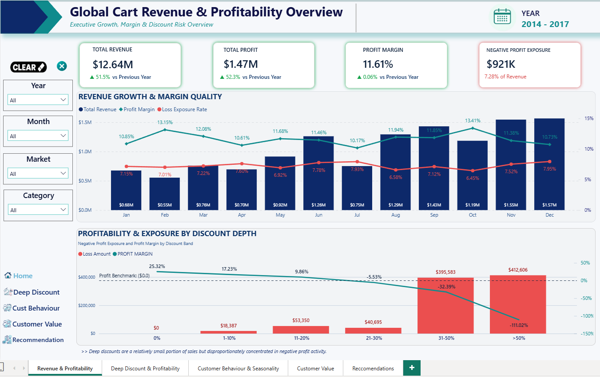
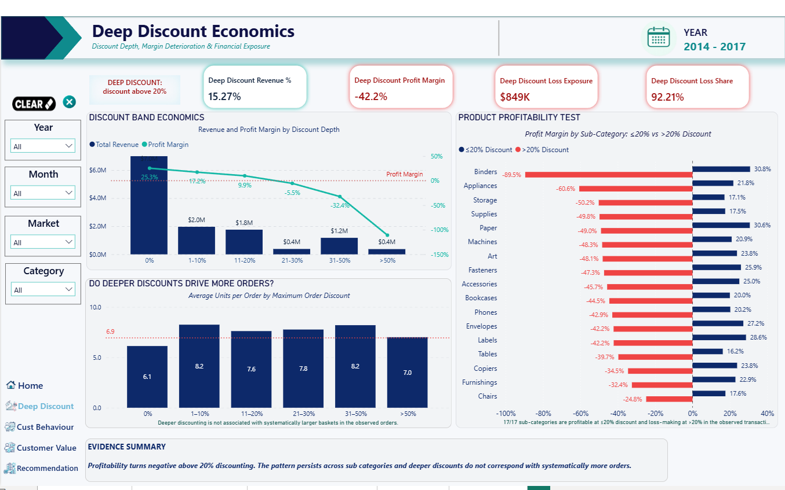
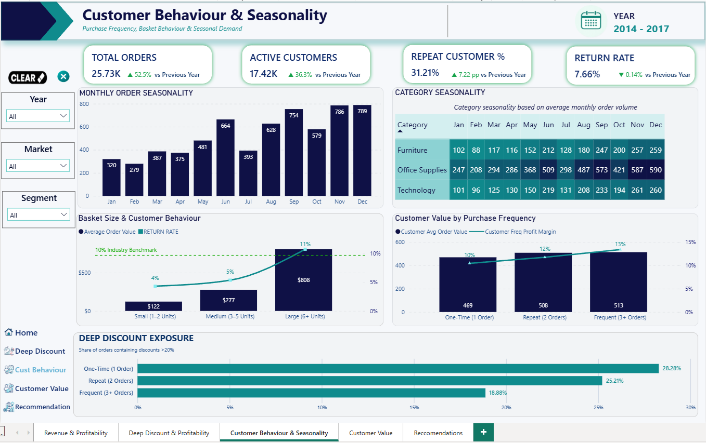
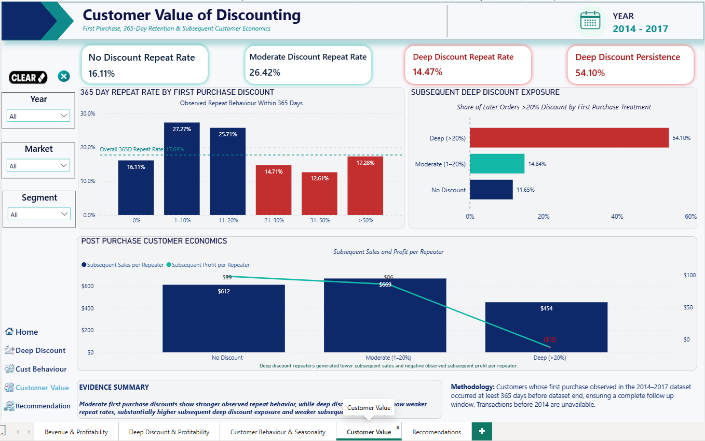

# 📊 E-commerce Revenue & Margin Leakage Analysis

### Power BI | DAX | Power Query | Data Modeling | Business Intelligence

> **Business Question:**  
> How can an e-commerce retailer reduce margin leakage from deep discounting without sacrificing sales volume, order value, or customer behavior?

---

## 📌 Project Overview

This Power BI project analyzes **revenue, profitability, discounting, customer behavior, and margin leakage** for a global e-commerce retailer.

The analysis goes beyond revenue performance to determine whether aggressive discounting creates enough additional business value to justify its impact on profitability.

The final dashboard was designed as a **decision-support tool for executives, operations leaders, and business unit managers**.

---

## 🎯 Business Problem

Discounts can help generate sales, but excessive discounting can significantly reduce margins.

This project investigates:

- How revenue and profitability change over time
- Where negative profit exposure is concentrated
- How profitability changes across discount levels
- Whether discounts above **20%** generate larger baskets or stronger customer behavior
- Which categories, products, and markets contribute most to margin leakage
- Whether tighter discount controls could improve profitability without materially reducing demand

---

## 📂 Dataset Overview

| Metric | Coverage |
|---|---:|
| Analysis Period | 2014–2017 |
| Revenue | ~$12.6M |
| Orders | ~25,700 |
| Products | ~3,800 |
| Countries | 165 |
| Customer Segments | 3 |
| Product Categories | 3 |

### Product Categories
- Furniture
- Office Supplies
- Technology

### Customer Segments
- Consumer
- Corporate
- Home Office

### Markets
- Africa
- Asia Pacific
- Europe
- Latin America
- United States & Canada

---

## 📊 Dashboard Overview



### 1. Executive Summary

Provides senior leadership with a high-level view of:

- Total Revenue
- Total Profit
- Profit Margin
- Orders
- Units Sold
- Average Order Value
- Return Rate
- Loss Exposure

Key visuals include:

- Revenue & Profit Trend
- Profit Margin & Loss Exposure Rate
- Negative Profit Exposure by Category

---

### 2. Deep Discount & Profitability Analysis



This section evaluates the relationship between discount levels and profitability.

Discounts were grouped into:

- 0%
- 0–10%
- 10–20%
- 20–30%
- 30–40%
- 40–50%
- >50%

A key focus was comparing:

**≤20% Discount**

versus

**>20% Discount**

to determine where discounting begins to materially damage profitability.

---

### 3. Customer Behaviour & Seasonality



This section evaluates whether deep discounting is associated with stronger customer value.

The analysis considers:

- Order frequency
- Average order value
- Profit margin
- Repeat purchasing
- Seasonal purchasing patterns

The objective was to determine whether margin sacrifice from aggressive discounting could be justified by stronger customer behavior.

---

### 4. Customer Value



This section examines whether customers exposed to deeper discounts generate enough additional value to justify the reduction in profit margin.

The analysis focuses on:

- Customer order frequency
- Average order value
- Repeat purchasing behavior
- Profitability by customer group
- Exposure to deep discounts
- Relationship between customer activity and margin contribution

The objective is to determine whether aggressive discounting creates stronger customer value or simply increases margin leakage.

---

## 🔎 Key Findings

### 1. Deep discounts significantly increase profit risk

Transactions above the **20% discount threshold** showed substantially greater exposure to negative profit.

### 2. Moderate discounts remain more commercially sustainable

Transactions receiving discounts of **20% or below** generally maintained healthier profitability.

### 3. All analyzed subcategories remained profitable at ≤20%

Across the **17 subcategories analyzed**, profitability remained positive at discounts of 20% or below, while deeper discounting significantly increased loss exposure.

### 4. Larger discounts did not consistently create larger baskets

Higher discount levels did not demonstrate enough improvement in average order value to offset the associated margin loss.

### 5. Deep discounts did not clearly produce stronger customer retention

The observed customer behavior did not provide sufficient evidence that aggressive discounts consistently generated stronger repeat purchasing.

### 6. Margin leakage is concentrated

Negative profit exposure was concentrated within specific:

- Products
- Subcategories
- Markets
- Discount levels

This creates an opportunity for **targeted intervention rather than eliminating discounts across the entire business**.

---

## 💡 Business Recommendations

### Recommendation 1 — Introduce a 20% Discount Governance Threshold

Discounts above 20% should require additional commercial justification or approval.

Suggested actions:

- Keep discounts ≤20% within normal commercial operations
- Flag discounts above 20% for review
- Monitor profitability before recurring deep-discount promotions
- Track products and markets with high deep-discount exposure
- Use Power BI reporting to monitor margin leakage

The objective is to protect profitability without eliminating commercial flexibility.

---

### Recommendation 2 — Run a Controlled Discount Pilot

Before implementing a company-wide policy, introduce tighter discount controls in selected markets or product groups.

Compare a **pilot group** against a **benchmark group** using:

- Revenue
- Orders
- Units Sold
- Average Order Value
- Profit Margin
- Repeat Customer Behavior
- Return Rate
- Loss Exposure Rate

The policy should only be expanded if profitability improves without materially reducing commercial performance.

---

## 📌 Executive Conclusion

> **Moderate discounts remain profitable and show stronger observed repeat behavior, while discounts above 20% account for a disproportionate share of negative profit exposure without evidence of larger baskets or stronger retention.**

The analysis suggests that the business does not need to eliminate discounting.

Instead, it should transition toward a more **controlled, targeted, and evidence-based discount strategy**.

---

## 🗂️ Data Model

The Power BI solution uses a star-schema-style model.

### Fact Table

**FactSales**

Contains transactional information including:

- Revenue
- Profit
- Quantity
- Discount
- Order information
- Return status

### Dimension Tables

**DimDate**
- Date
- Year
- Month
- Year-Month

**DimProduct**
- Product
- Category
- Subcategory

**DimCustomer**
- Customer
- Customer Segment

**DimMarket / Region**
- Market
- Region
- Geographic attributes

---

## 🧮 Sample DAX Measures

```DAX
Total Revenue = SUM(FactSales[Sales])
```

```DAX
Total Profit = SUM(FactSales[Profit])
```

```DAX
Profit Margin = DIVIDE([Total Profit],[Total Revenue],0)
```

```DAX
Average Order Value =DIVIDE([Total Revenue],[Order Count],0)
```

```DAX
Discounted Sales = CALCULATE([Total Revenue],FactSales[Discount] > 0)
```

```DAX
% Contribution to Total Loss = DIVIDE([Total Loss Amount],CALCULATE([Total Loss Amount],ALL(DimProduct)),0)
```

---

## 🛠️ Tools & Technologies

| Tool | Purpose |
|---|---|
| Power BI | Dashboard development and visualization |
| Power Query | Data cleaning and transformation |
| DAX | KPI and analytical measure development |
| Data Modeling | Fact and dimension model design |
| GitHub | Project documentation and portfolio presentation |

---

## 💼 Skills Demonstrated

- Business Intelligence
- Data Analysis
- Data Modeling
- Power Query
- DAX
- KPI Development
- Profitability Analysis
- Discount Analysis
- Customer Behavior Analysis
- Time Intelligence
- Data Visualization
- Data Storytelling
- Business Recommendations
- Executive Dashboard Design

---

## 📥 Power BI Report

The complete `.pbix` file is available in this repository:

**`Project 3 - Revenue & Discount Analysis.pbix`**

> Microsoft Power BI Desktop is required to open the report.

---

## 👤 Author

**Clinton Taguba**

Data Analyst focused on transforming business and operational data into actionable insights using **Power BI, SQL, Python, and data visualization**.

---

## ⭐ Project Objective

This project demonstrates how data analysis can move beyond reporting and support real business decisions.

The objective was not simply to visualize sales performance, but to answer:

> **Where is the business sacrificing profitability, why is it happening and what action should management take?**
